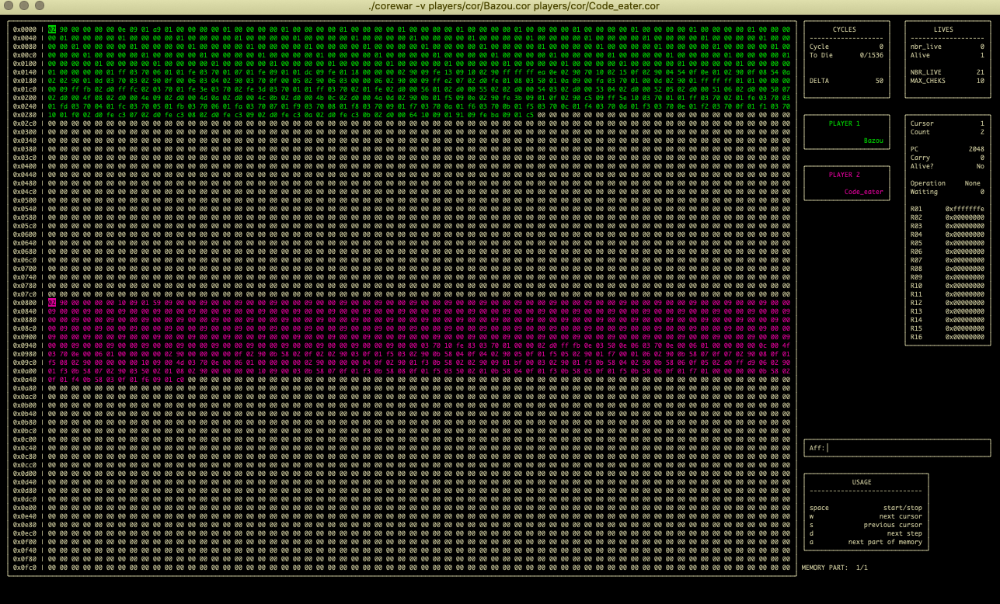

# corewar is 21 school project: create a corewar (virtual machine), asm (assembler), dis_asm (disassembler) and champion (fighting program).
 
A <b>champion</b> is written in assembly syntax. A champion is compiled by the asm (assembler), into a binary file. The compiled champion is then loaded into corewar (virtual machine) as a process, with other champions; and their bytecode is loaded into virtual circular memory.
 
 
<b>asm</b> must take as an argument a champion with a '.s' file extension. If the champion is valid, it must be compiled. The compiled '.cor' binary must be placed in the same directory and with the same filename as the assembly file. 
<b>dis_asm</b> does exactly the opposite - turns a champion .cor binary file into a assembler language and write to .s file 

 
To compile, run make
 
